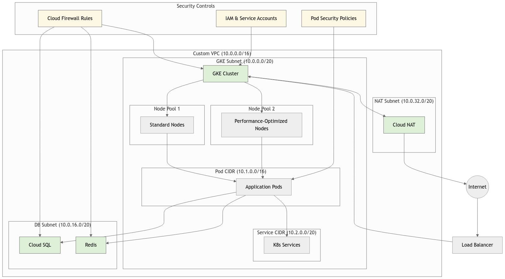
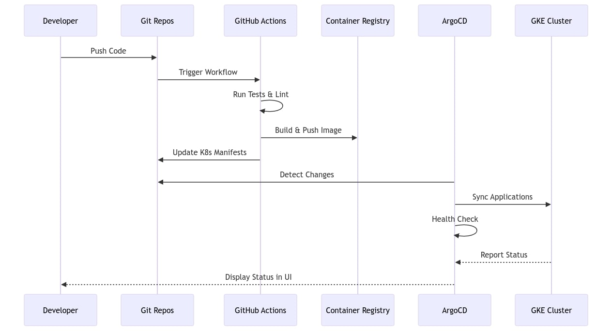

All the code related to the tasks described in this document is organized into specific folders labeled by the respective task numbers. 

**Please refer to this documentation first before reviewing the code.** 

This ensures a clear understanding of the context and purpose of each task before diving into the implementation details.

## TASK 01 - Terraform & Infrastructure-as-Code (IaC)

### Overview
This project automates the deployment of a **Google Kubernetes Engine (GKE) cluster** on Google Cloud Platform (GCP) using **Terraform**. It includes:

- A custom **VPC** with subnets.
- A **GKE cluster** with two node pools:
  - **General-purpose node pool** for regular workloads.
  - **CPU-intensive node pool** for compute-heavy tasks.
- Secure Terraform state management in a **Google Cloud Storage (GCS) bucket**.
- Automation using **GitHub Actions (TFActions)** for CI/CD workflows.

---

## Features

### 1. Infrastructure as Code (IaC)
- Fully automated infrastructure provisioning with Terraform.
- Modular and reusable code structure.

### 2. Networking
- Custom VPC with subnet ranges for workload separation.
- Subnet allocation for:
  - General-purpose workloads.
  - CPU-intensive workloads.

### 3. Kubernetes Cluster
- **GKE cluster** with two specialized node pools:
  - **General-purpose workloads**: `e2-standard-4` machines.
  - **CPU-intensive workloads**: `n2-highcpu-8` machines.

### 4. State Management
- Terraform state is securely stored in a versioned **GCS bucket**.

### 5. CI/CD Automation
- **GitHub Actions workflow** automates:
  - Validation.
  - Planning.
  - Application of Terraform changes.

---

## References
- [Terraform Google Provider Documentation](https://registry.terraform.io/providers/hashicorp/google/latest/docs/guides/getting_started)

---


# TASK 02 - GCP Concepts & Networking

## Architectural Overview
The proposed network architecture is designed to create a secure, scalable, and cost-effective environment using Google Cloud Platform (GCP) services, specifically integrating Google Kubernetes Engine (GKE), CloudSQL, and Redis within a custom Virtual Private Cloud (VPC).

## Network Architecture Design

### System Design Diagram


### VPC and Subnet Configuration
The custom VPC (`10.0.0.0/16`) is strategically segmented into three primary subnets:

- **GKE Subnet (`10.0.0.0/20`)**
  - Hosts the Kubernetes cluster infrastructure
  - Divided into two node pools:
    - **Standard Workload Node Pool**: For typical application workloads
    - **High-Performance Node Pool**: For compute-intensive applications
  - Internal CIDR allocations:
    - **Pod CIDR (`10.1.0.0/16`)**: Supports pod-level networking
    - **Service CIDR (`10.2.0.0/20`)**: Manages Kubernetes service endpoints

- **Database Subnet (`10.0.16.0/20`)**
  - Isolates stateful services
  - Hosts CloudSQL and Redis instances
  - Provides network-level separation from compute resources

- **NAT Subnet (`10.0.32.0/20`)**
  - Manages external internet connectivity
  - Implements Cloud NAT for controlled outbound internet access

## Security Implementation
#### Network Security Mechanisms
- **Firewall Rules**
  - Implement granular access controls
  - Restrict communication between subnets
  - Enforce least-privilege network policies
  - Prevent unauthorized inter-service communication

- **Identity and Access Management (IAM)**
  - Utilize service accounts with minimal permissions
  - Implement role-based access control (RBAC)
  - Enable workload identity for secure service authentication

- **Kubernetes Security**

    - Apply Pod Security Policies
    - Restrict container privileges
    - Implement network policies to control pod-to-pod communication

#### Data Protection Strategies
- End-to-end encryption for data in transit and at rest
- Private service access for CloudSQL and Redis
- Restricted network access using VPC service controls

## Cost Optimization Approaches
#### Compute Resource Management
**GKE Node Pool Optimization**
  - Dual node pool strategy:
    - Standard nodes for regular workloads
    - Performance-optimized nodes for intensive tasks
  - Leverage preemptible VMs for non-critical workloads
  - Implement horizontal and cluster autoscaling

**Networking Cost Reduction**
- Minimize data transfer costs through regional service placement
- Utilize Cloud NAT for controlled, cost-effective external access
- Implement committed use discounts for stable workloads

#### Service-Specific Optimization
- Right-size database and cache instances
- Use sustained use discounts
- Implement auto-scaling for database and Redis services

#### High Availability Architecture
- Multi-zone GKE cluster deployment
- Regional CloudSQL instances with automatic failover
- Distributed Redis cluster configuration
- Load balancing across multiple zones
- Automatic healing and replacement of failed instances

#### Connectivity Model
- External traffic routed through load balancer
- Secure internet egress via Cloud NAT
- Internal service communication within VPC
- Controlled pod-to-service interactions

#### Monitoring and Governance
- Enable VPC flow logs
- Implement Cloud Monitoring and Logging
- Use Cloud Security Command Center
- Set up budget alerts and cost tracking

## Conclusion

This architecture provides a robust, secure, and cost-effective solution for hosting microservices with managed database and caching infrastructure in Google Cloud Platform.

---

## TASK 03 - CI/CD & GitHub Actions

## Pipeline Workflow

The pipeline is triggered on:
- **Pushes** to the `main` branch
- **Pull Requests**

It consists of three main jobs:

1. **test-and-lint**: Runs tests and linting
2. **build-and-push**: Builds and pushes Docker image to GCR
3. **update-manifests**: Updates Kubernetes manifests in a separate repository

---

## Testing and Linting

- **Environment**: Uses Node.js setup for a React application
- **Tools**:
  - Runs **ESLint** for code quality checks
  - Executes **unit tests** using Jest (React's default testing framework)
- **Pipeline Requirements**:
  - All tests and linting must pass before proceeding to the build stage

---

## Docker Build and Push

- **Authentication**: Authenticates with Google Cloud
- **Docker Image Build**:
  - Builds Docker image with two tags:
    1. **Latest commit SHA** for version tracking
    2. **`latest` tag** for convenience
- **Image Push**:
  - Pushes both tags to Google Container Registry (GCR)

---

## Kubernetes Manifests

- **Repository**: Kubernetes manifests stored in a separate repository (GitOps approach)
- **Components**:
  - **Deployment**: Includes resource limits and health checks
  - **Service**: Facilitates internal communication
  - **Ingress**: Provides external access
- **Pipeline Automation**:
  - Automatically updates the image tag in `deployment.yaml`

---

## ArgoCD Integration

- **ArgoCD Application Manifest**:
  - Defines source repository (`k8s-manifests`)
  - Specifies destination cluster and namespace
  - Configures automated sync policy
  - Supports namespace creation if needed

---

## Required Secrets

Configure the following secrets in your GitHub repository:

- **`GCP_PROJECT_ID`**: Your Google Cloud project ID
- **`GCP_SA_KEY`**: Service account key with permissions for GCR and GKE
- **`DEPLOY_KEY`**: SSH key for accessing the manifests repository

---

## Setup Steps

### Repositories

1. Create two repositories:
   - **Main application repository** with React code
   - **Kubernetes manifests repository**

### ArgoCD Installation

1. Install ArgoCD in your GKE cluster:
   ```bash
   kubectl create namespace argocd
   kubectl apply -n argocd -f https://raw.githubusercontent.com/argoproj/argo-cd/stable/manifests/install.yaml
   ```

2. Apply the ArgoCD application manifest:
   ```bash
   kubectl apply -f argocd-application.yaml
   ```

#### More Information About ArgoCD and Setup

For detailed information and setup instructions, refer to this part of ArgoCD documentation:
[ArgoCD Getting Started Guide](https://argo-cd.readthedocs.io/en/stable/getting_started)
(Additionally this document includes the setup method of argoCD application using UI as well)

---

## Best Practices Implemented

- **Separation of Concerns**: Application code and infrastructure code are managed in separate repositories.
- **GitOps Workflow**: Manifests repository integrates with ArgoCD for automated deployments.
- **Automated Testing**: Ensures quality with linting and unit tests.
- **Resource Management**: Kubernetes manifests include resource limits and health checks.
- **Traceability**: Docker images use immutable tags (commit SHA) for tracking.
- **Automated Rollouts**: ArgoCD detects changes and deploys automatically.

---

## Workflow

1. Developer pushes code to the `main` branch.
2. GitHub Actions runs tests and linting.
3. On success:
   - Builds and pushes a new Docker image to GCR.
   - Updates the manifests repository with the new image tag.
4. ArgoCD detects changes in the manifests repository and automatically deploys updates to GKE.

### Diagram about the process


## TASK 04 - Security & Automation Guardrails

### Conftest Policy for Terraform Encryption and Project Restriction

Conftest allows you to enforce compliance and security policies for infrastructure code by using the Open Policy Agent (OPA) and its policy language, Rego. In this example, we define a Conftest policy to ensure the following:

- **Encryption**: All Google Cloud Storage (GCS) buckets must have encryption enabled.
- **Project Restriction**: GCS buckets must belong to a set of allowed projects.

By enforcing these rules, we can ensure that the infrastructure deployments comply with security and organizational standards.

## Policy File

The policy is written in Rego and should be placed in a file, e.g., `policy/gcs_bucket_policy.rego`.

### Policy: `gcs_bucket_policy.rego`

```rego
package main

# Rule to ensure all GCS buckets have encryption enabled.
deny[msg] {
  input.resource.type == "google_storage_bucket"
  not input.resource.values.encryption
  msg := sprintf("Bucket '%s' must have encryption enabled.", [input.resource.name])
}

# Rule to ensure all GCS buckets are restricted to specific projects.
deny[msg] {
  input.resource.type == "google_storage_bucket"
  allowed_projects := ["project-12345", "project-67890"] # Add allowed project IDs here
  not contains(allowed_projects, input.resource.values.project)
  msg := sprintf("Bucket '%s' must belong to one of the allowed projects: %s.", [input.resource.name, allowed_projects])
}
```

## Explanation

### Rule 1: Encryption Enforcement

- **Condition**: The resource type is `google_storage_bucket`, and the encryption configuration is missing.
- **Action**: If the bucket does not have encryption enabled, a violation message is generated, specifying the bucket name.

### Rule 2: Project Restriction

- **Condition**: The resource type is `google_storage_bucket`, and the project ID is not in the `allowed_projects` list.
- **Action**: If the bucket belongs to an unauthorized project, a violation message is generated, specifying the bucket name and the allowed projects.

## Running the Policy

To apply the policy and test Terraform configurations:

1. **Generate a Terraform plan**:
   ```bash
   terraform plan -out=tfplan
   terraform show -json tfplan > tfplan.json
   ```

2. **Run Conftest**:
   ```bash
   conftest test tfplan.json --policy policy/
   ```

- **Output**: If any bucket fails to comply with the policies, Conftest will report the violations with detailed messages.

## Benefits of Using Conftest

- **Automation**: Policies can be integrated into CI/CD pipelines to automatically enforce compliance.
- **Security**: Ensures that infrastructure meets security standards before deployment.
- **Scalability**: Easily enforce policies across multiple projects and teams.

## Conclusion

This policy demonstrates how Conftest can be used to ensure that GCS buckets are deployed securely and comply with organizational requirements. By using Rego to define policies, you gain fine-grained control over your infrastructure's compliance and security.

---

## Docker Image Security Scan with Trivy in GitHub Actions

The following GitHub Actions workflow demonstrates how to scan Docker images for vulnerabilities using Trivy. This ensures that your container images meet security standards before deployment.

## Workflow: `docker-security-scan.yml`

```yaml
name: Docker Image Security Scan

on:
  push:
    branches: [ main ]
  pull_request:
    branches: [ main ]

jobs:
  scan:
    runs-on: ubuntu-latest
    steps:
      - name: Checkout code
        uses: actions/checkout@v3
      
      - name: Build Docker image
        run: docker build -t myapp:${{ github.sha }} .
      
      - name: Run Trivy vulnerability scanner
        uses: aquasecurity/trivy-action@master
        with:
          image-ref: 'myapp:${{ github.sha }}'
          format: 'table'
          exit-code: '1'
          ignore-unfixed: true
          vuln-type: 'os,library'
          severity: 'CRITICAL,HIGH'
```

## Explanation

### Steps

1. **Checkout Code**:
   The `actions/checkout@v3` action checks out the repository code to the GitHub Actions runner.

2. **Build Docker Image**:
   The `docker build` command builds the Docker image using the latest commit SHA as the tag.

3. **Run Trivy**:
   - The `aquasecurity/trivy-action` action scans the built Docker image for vulnerabilities.
   - **Options**:
     - `image-ref`: Specifies the image to scan (`myapp:${{ github.sha }}`).
     - `format`: Outputs the results in table format.
     - `exit-code`: Exits with code `1` if critical or high vulnerabilities are found.
     - `ignore-unfixed`: Ignores vulnerabilities that do not yet have a fix.
     - `vuln-type`: Scans for OS and library vulnerabilities.
     - `severity`: Limits the report to `CRITICAL` and `HIGH` vulnerabilities.

## Benefits of Trivy in CI/CD

- **Proactive Security**: Identifies vulnerabilities early in the development process.
- **Integration**: Seamlessly integrates into GitHub Actions workflows.
- **Comprehensive Scanning**: Detects both OS and library vulnerabilities, ensuring thorough coverage.

## Conclusion

This workflow illustrates how to incorporate Trivy into your CI/CD pipeline to enforce security standards for Docker images. By automating vulnerability scanning, you can reduce risks and maintain compliance throughout the development lifecycle.

## References

- [Policy as Code using Conftest for Terraform](https://azizzoaib.medium.com/policy-as-code-using-conftest-for-terraform-9b24921b2ad2)
- [Trivy Documentation](https://trivy.dev/v0.16.0/)
- [Conftest Documentation](https://www.conftest.dev/)

---

## TASK 05 - Problem-Solving & Troubleshooting Scenario

### Approach to Troubleshooting the Issue

### A. Understand the Problem Scope
1. **Identify Impact**: Determine which service or features are down and their criticality to the business.
2. **Gather Context**: Review the error logs, Kubernetes events, and any recent changes to the cluster, deployments, or networking.

### B. Break Down the Problem
1. **Application Level**: Check the pods for errors or restarts in their logs (`kubectl logs`).
2. **Networking Level**: Investigate connectivity between the application pods and CloudSQL using tools like `kubectl exec` and `ping`.
3. **CloudSQL Level**: Ensure the database is healthy and accessible.

---

## Tools and Steps to Resolve the Network Timeout

### Step 1: Verify Pod Health
- Use `kubectl get pods` and `kubectl describe pod` to check for pod health, error events, and resource usage.
- Check if the pods are in a `CrashLoopBackOff` or `Pending` state, which might indicate resource issues.

### Step 2: Test Network Connectivity
- **From Pods**: Use `kubectl exec` to run commands like `curl` or `telnet` from the pods to the CloudSQL IP or hostname.
  ```bash
  kubectl exec -it <pod-name> -- curl -v <CloudSQL-IP>:3306
  ```
- **Within Cluster**: Use `kubectl run` to create a temporary debugging pod to test network paths.
  ```bash
  kubectl run test-pod --image=alpine --restart=Never -- /bin/sh
  # Inside the pod
  ping <CloudSQL-IP>
  ```

### Step 3: Check GCP Firewall and VPC
- Ensure that the CloudSQL instance allows traffic from the GKE cluster by:
  - Verifying **Firewall Rules** in the GCP Console.
  - Ensuring the application pods' IP range (from the cluster’s VPC) is whitelisted.
- Confirm that the CloudSQL private IP (if used) is accessible within the same VPC.

### Step 4: Inspect CloudSQL Connection
- If using the Cloud SQL Auth proxy, ensure the proxy is running and configured correctly.
- Verify connection parameters in the application configuration (`DB_HOST`, `DB_PORT`, etc.).

### Step 5: Analyze Recent Changes
- Review Kubernetes deployment history (`kubectl rollout history`) for recent changes to the deployment or configurations.
- Check GCP Audit Logs for any recent changes in network configurations or IAM roles.

### Step 6: Check Cluster and Node Health
- Use `kubectl get nodes` and `kubectl describe node` to confirm all nodes are healthy.
- Verify there are no resource constraints causing issues.

---

## Preventing Future Occurrences

### A. Improve Monitoring and Alerting
- Use **GCP Cloud Monitoring** to set up alerts for CloudSQL connection errors or Kubernetes pod restarts.
- Monitor network latency using tools like **Prometheus** and **Grafana**.

### B. Enhance Networking Resilience
- **Enable Private IP** for CloudSQL: This reduces the risk of public network issues.
- **Configure Connection Pooling**: Use connection poolers like **PgBouncer** or set up retries in the application.

### C. Automate Configuration Validation
- Use **Policy as Code** tools like **Open Policy Agent (OPA)** or **Kyverno** to enforce proper network and resource configurations.

### D. Periodic Audits
- Regularly audit Kubernetes manifests and GCP network configurations.
- Review firewall rules, service accounts, and IAM roles to minimize the blast radius of misconfigurations.


